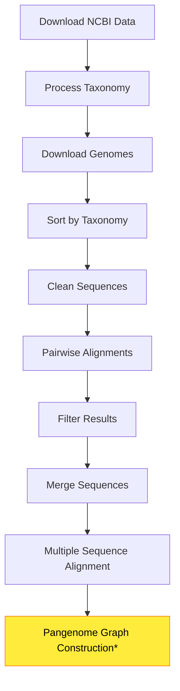

# PlantEuka 🌱🌿🌻

**PlantEuka** is an extension of **Euka** ([Nicola et al., 2023](https://doi.org/10.1111/2041-210X.14214)), which uses a taxon-based pangenome graph for analyzing ancient environmental DNA (aeDNA). While **Euka** has shown great potential, it is limited to tetrapod and arthropod mitochondrial genomes (mitogenomes).

The **PlantEuka** project aims to develop a customized plant database module for **Euka**. This enhancement will improve the accuracy and representation of plant species, enabling the identification of plant species using a taxon-based pangenome graph.

## 🎯 Project Goals

- **Enhance plant biodiversity understanding** in various environments
- **Improve species identification accuracy** using taxon-based pangenome graphs
- **Extend Euka's capabilities** to include comprehensive plant genomic data
- **Provide reliable data** for ecological and biological research

## 📋 Prerequisites

Before running PlantEuka, ensure you have the following dependencies installed:

### Required Software
- **Python 3.7+** with packages: `pandas`, `biopython`, `collections`
- **Snakemake 6.0+** for workflow management
- **EMBOSS** suite (specifically `stretcher` tool)
- **MAFFT** for multiple sequence alignment
- **wget** for downloading NCBI data
- **Standard Unix tools**: `bash`, `gzip`, `tar`

### Installation
```bash
# Install conda dependencies
conda install -c conda-forge snakemake pandas biopython
conda install -c bioconda emboss mafft

# Or using pip for Python packages
pip install pandas biopython snakemake
```

## 🚀 Quick Start

### Option 1: Automated Workflow (Recommended)
```bash
# Clone the repository
git clone <repository-url>
cd PlantEuka

# Run the complete workflow using Snakemake
snakemake --cores 4

# For dry run (check workflow without execution)
snakemake --dry-run
```

### Option 2: Manual Step-by-Step Execution
Follow the [Manual Workflow](#manual-workflow) section below.

## 📊 Workflow Overview


*\*Currently under development*

## 🔧 Automated Workflow (Snakemake)

The entire PlantEuka pipeline is automated using Snakemake. The workflow includes:

1. **Data Download**: NCBI taxonomy and accession data
2. **Genome Processing**: Download, sort, and clean genomic sequences
3. **Quality Control**: Pairwise alignment and filtering
4. **Sequence Analysis**: Multiple sequence alignment preparation

### Configuration
Edit `ncbi_info.txt` to specify your search parameters before running.

### Execution
```bash
# Run with 4 CPU cores
snakemake --cores 4

# Run specific rule
snakemake <rule_name> --cores 4

# Generate workflow visualization
snakemake --dag | dot -Tpng > workflow.png
```

## 📚 Manual Workflow

If you prefer to run steps manually or need to customize the workflow:

### Step 1: Download NCBI Data
Download taxonomy files and genome accession mappings:
```bash
# Download taxonomy files
wget -bqc -P other https://ftp.ncbi.nlm.nih.gov/pub/taxonomy/taxdump.tar.gz
wget -bqc -P other https://ftp.ncbi.nlm.nih.gov/pub/taxonomy/accession2taxid/nucl_gb.accession2taxid.gz

# Extract taxonomy data
tar -zxvf other/taxdump.tar.gz -C other nodes.dmp names.dmp
```

### Step 2: Process Taxonomy Information
Generate taxonomy and lineage information:
```bash
scripts/taxonomy_lineage.py
```
Creates `taxonomy.tsv` and `lineage.tsv` from NCBI taxonomy files.

### Step 3: Download Genomes
Connect with NCBI's GenBank database and retrieve sequences:
```bash
scripts/download_genomes.py <organelle>
```
Downloads genomes matching the query in `ncbi_info.txt`.

### Step 4: Map Accessions to Taxonomy
```bash
scripts/accession_taxid.sh
```
Matches downloaded accession numbers with their taxonomic IDs.

### Step 5: Organize Genomes by Taxonomy
```bash
scripts/organize_genomes.py <organelle>
```
Sorts genomes into taxonomic directories (genus, family, order) with ≥10 species per group.

### Step 6: Clean Genome Sequences
```bash
scripts/clean_genomes.py <organelle>
```
Replaces non-standard nucleotide characters with 'N' and logs changes.

### Step 7: Pairwise Sequence Alignment
Generate pairwise alignment lists and run EMBOSS stretcher:
```bash
# Generate all possible pairs within taxonomic groups
scripts/pairwise_list_parallel.sh <organelle>

# Run pairwise alignments (example for single pair)
stretcher -asequence seq1.fasta -bsequence seq2.fasta -gapopen 16 -gapextend 4 -outfile pair.stretcher
```

### Step 8: Process and Filter Alignment Results
```bash
# Gather results into single TSV file
scripts/pairwise_results.py

# Apply quality filters
scripts/pairwise_filter.py
```

**Quality Control Criteria:**
- **Similarity > 99%**: Remove duplicates (keep one sequence)
- **50% < Similarity < 90%**: Keep for analysis
- **Gaps < 15%**: Ensure good alignment quality
- **Score > MaxScore/2**: Keep high-quality alignments only

### Step 9: Multiple Sequence Alignment
```bash
# Merge sequences per taxonomic group
scripts/merge_genomes.sh <sorted_directory> <merged_directory>

# Generate MAFFT input/output paths
scripts/msa_paths_parallel.py

# Run MAFFT alignments
mafft --auto --thread -1 merged_sequences.fasta > alignment.fasta
```

## 📁 Output Structure

```
PlantEuka/
├── other/                          # Taxonomy and metadata
│   ├── taxonomy.tsv
│   ├── lineage.tsv
│   └── accession_taxid.txt
├── chloroplast/
│   ├── genomes/
│   │   ├── sorted/                 # Organized by taxonomy
│   │   └── merged/                 # Merged for MSA
│   ├── results/
│   │   ├── pairwise/              # Alignment results
│   │   └── msa/                   # Multiple sequence alignments
│   └── other/                     # Logs and metadata
└── scripts/                       # Pipeline scripts
```

## 🔍 Quality Metrics

The pipeline provides comprehensive quality control:

- **Taxonomic Coverage**: Minimum 10 species per taxonomic group
- **Sequence Quality**: Non-standard nucleotides cleaned
- **Alignment Quality**: Pairwise similarity and gap content filtering
- **Duplicate Removal**: >99% similar sequences deduplicated
- **Logging**: Detailed logs for each processing step

## 🧬 Future Development

### Pangenome Graph Construction
Currently under development. The next phase will include:
- Graph-based representation of sequence variation
- Variant calling and annotation
- Integration with Euka framework
- Species identification algorithms

## 🤝 Contributing

Contributions are welcome! Please:
1. Fork the repository
2. Create a feature branch
3. Submit a pull request with detailed description

## 📝 Citation

If you use PlantEuka in your research, please cite:
- **Euka**: Nicola et al. (2023). DOI: [10.1111/2041-210X.14214](https://doi.org/10.1111/2041-210X.14214)
- **PlantEuka**: [Citation pending publication]

## 📧 Support

For questions, issues, or suggestions:
- Open an issue on GitHub
- Contact the development team

## 📄 License

[Add appropriate license information]


